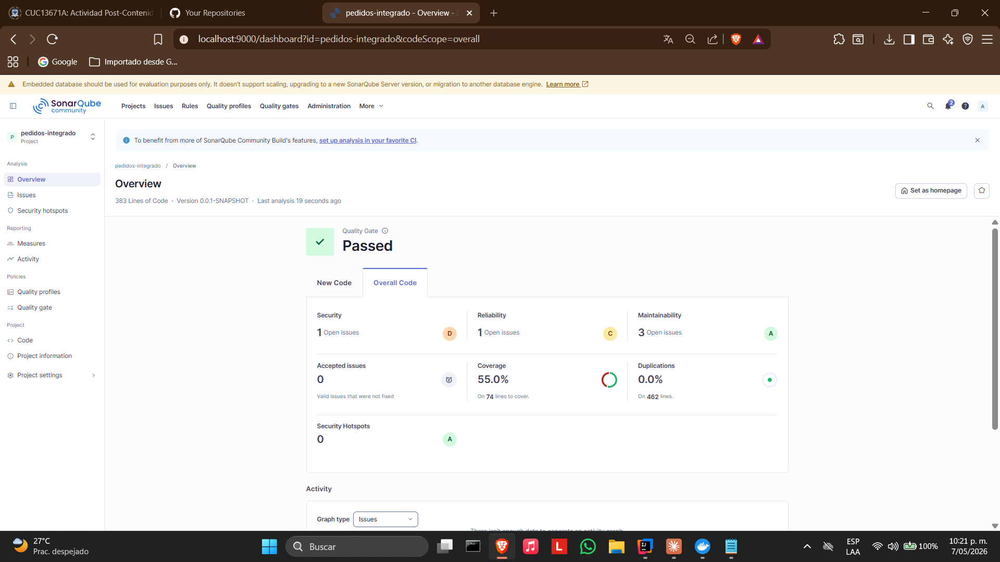

# Pedidos Integrado — Post-Contenido 1 Unidad 12


Sistema de gestión de pedidos en **Spring Boot 3** que integra cuatro patrones de diseño (Factory, Strategy, Observer y Facade) sobre una arquitectura hexagonal, verificando el desacoplamiento entre capas y comparando métricas de calidad con SonarQube.

---

## Tecnologías utilizadas

- Java 21
- Spring Boot 3
- Spring Data JPA
- H2 Database (en memoria)
- Lombok
- Maven
- JaCoCo 0.8.11
- SonarQube Community Edition (Docker)
- JUnit 5

---

## Estructura del proyecto (feature-first)

```
pedidos-integrado/
└── src/main/java/com/empresa/pedidos/
    ├── PedidosApplication.java
    ├── dominio/
    │   ├── Pedido.java
    │   ├── TipoPedido.java
    │   ├── EstadoPedido.java
    │   └── puertos/
    │       ├── RepositorioPedidos.java       # Puerto de persistencia
    │       ├── ProcesadorPedido.java         # Puerto Strategy
    │       └── ServicioNotificacion.java     # Puerto Observer
    ├── aplicacion/
    │   ├── ServicioPedidosLegacy.java        # Código inicial con smells
    │   └── PedidoProcesadoEvent.java         # Evento de dominio
    ├── infraestructura/
    │   ├── persistencia/
    │   │   └── RepositorioPedidosJpa.java
    │   └── notificaciones/
    │       ├── NotificacionEmail.java        # Observer: listener email
    │       └── NotificacionLog.java          # Observer: listener log
    └── adaptadores/
        ├── procesadores/
        │   ├── ProcesadorPedidoEstandar.java
        │   ├── ProcesadorPedidoExpress.java
        │   ├── ProcesadorPedidoInternacional.java
        │   └── ProcesadorPedidoFactory.java  # Factory
        ├── facade/
        │   └── FachadaPedidos.java           # Facade
        └── rest/
            └── PedidoController.java
```

---

## Cómo ejecutar el proyecto

### 1. Compilar y ejecutar pruebas

```bash
mvn clean verify
```

### 2. Levantar SonarQube con Docker

```bash
docker start sonarqube
```

Acceder en: [http://localhost:9000](http://localhost:9000)

### 3. Ejecutar análisis de SonarQube

```bash
mvn clean verify sonar:sonar -Dsonar.host.url=http://localhost:9000 -Dsonar.token=TU_TOKEN -Dsonar.projectKey=pedidos-integrado
```

### 4. Probar el endpoint REST

```bash
curl -X POST http://localhost:8080/api/pedidos \
  -H "Content-Type: application/json" \
  -d '{"tipo":"ESTANDAR","subtotal":100.0}'
```

---

## Punto de partida — Código Legacy con smells

Antes de aplicar los patrones, el sistema tenía un único servicio monolítico `ServicioPedidosLegacy` con todas las responsabilidades mezcladas:

```java
// ANTES — Lógica mezclada: tipo, cálculo, persistencia y notificación
public void procesarPedido(Pedido pedido) {
    if (pedido.getTipo() == TipoPedido.ESTANDAR) {
        pedido.setCosto(pedido.getSubtotal() * 1.1);
    } else if (pedido.getTipo() == TipoPedido.EXPRESS) {
        pedido.setCosto(pedido.getSubtotal() * 1.3);
    } else if (pedido.getTipo() == TipoPedido.INTERNACIONAL) {
        pedido.setCosto(pedido.getSubtotal() * 1.5 + 25.0);
    }
    pedido.setEstado(EstadoPedido.PROCESADO);
    repo.save(pedido);
    mail.send(crearMensaje(pedido));
}
```

**Problemas identificados:**
- Cyclomatic Complexity = 4, Cognitive Complexity = 6
- Acoplamiento directo a `JavaMailSender` y `JpaRepository` desde la capa de aplicación
- Violación de SRP: un método hace validación, cálculo, persistencia y notificación
- Switch Statement smell: cada nuevo tipo de pedido requiere modificar el método

---

## Patrones de diseño integrados

### 1. Strategy — Desacoplar el algoritmo de cálculo

**Problema que resuelve:** El `if/else if` para cada tipo de pedido viola el principio Open/Closed — agregar un nuevo tipo requería modificar el servicio principal.

**Solución:** Se define el puerto `ProcesadorPedido` con tres implementaciones independientes, una por tipo de pedido. Cada implementación encapsula su propio algoritmo de cálculo de costo.

```java
// Puerto Strategy
public interface ProcesadorPedido {
    TipoPedido getTipo();
    void procesar(Pedido pedido);
}

// Cada implementación tiene CC = 1
@Component
public class ProcesadorPedidoEstandar implements ProcesadorPedido {
    public void procesar(Pedido pedido) {
        pedido.setCosto(pedido.getSubtotal() * 1.1);
        pedido.setEstado(EstadoPedido.PROCESADO);
    }
}
```

**Resultado:** La CC del flujo principal bajó de 4 a 1. Agregar un nuevo tipo de pedido solo requiere crear una nueva clase sin tocar el código existente.

---

### 2. Factory — Selección dinámica de Strategy

**Problema que resuelve:** El cliente no debe conocer qué implementación de `ProcesadorPedido` usar según el tipo. La selección debe estar encapsulada.

**Solución:** `ProcesadorPedidoFactory` recibe todas las implementaciones de `ProcesadorPedido` inyectadas por Spring en una lista, las indexa por tipo en un `Map` y expone un método `obtener(TipoPedido)`.

```java
@Component
public class ProcesadorPedidoFactory {
    private final Map<TipoPedido, ProcesadorPedido> procesadores;

    public ProcesadorPedidoFactory(List<ProcesadorPedido> lista) {
        this.procesadores = lista.stream().collect(
                Collectors.toMap(ProcesadorPedido::getTipo, Function.identity())
        );
    }

    public ProcesadorPedido obtener(TipoPedido tipo) {
        return Optional.ofNullable(procesadores.get(tipo))
                .orElseThrow(() -> new IllegalArgumentException(
                        "Tipo de pedido no soportado: " + tipo));
    }
}
```

**Resultado:** El cliente solo llama `factory.obtener(tipo).procesar(pedido)` sin conocer las implementaciones concretas.

---

### 3. Observer — Notificación desacoplada con Spring Events

**Problema que resuelve:** El servicio legacy tenía acoplamiento directo a `JavaMailSender`, mezclando la lógica de notificación con la de negocio. Agregar un nuevo canal de notificación requería modificar el servicio.

**Solución:** Se define el evento de dominio `PedidoProcesadoEvent` y dos listeners independientes (`NotificacionEmail`, `NotificacionLog`) anotados con `@EventListener`. La Facade publica el evento con `ApplicationEventPublisher` sin conocer quién lo escucha.

```java
// Evento de dominio
public record PedidoProcesadoEvent(Pedido pedido) {}

// Listener independiente — no modifica la Facade
@Component
public class NotificacionEmail implements ServicioNotificacion {
    @EventListener
    public void notificar(PedidoProcesadoEvent evento) {
        System.out.println("Email enviado para pedido: " + evento.pedido().getId());
    }
}
```

**Resultado:** Agregar un nuevo canal de notificación (SMS, push) solo requiere crear un nuevo listener con `@EventListener` sin modificar ninguna clase existente.

---

### 4. Facade — Simplificar la interfaz para el controlador REST

**Problema que resuelve:** El controlador REST no debe conocer la Factory, el repositorio ni el publisher de eventos. Exponer esa complejidad al controlador viola el principio de mínimo conocimiento.

**Solución:** `FachadaPedidos` unifica las operaciones del sistema en una interfaz simple. El controlador solo depende de la Facade.

```java
@Service
public class FachadaPedidos {
    public Pedido crearPedido(Pedido pedido) {
        factory.obtener(pedido.getTipo()).procesar(pedido);
        var guardado = repositorio.guardar(pedido);
        publisher.publishEvent(new PedidoProcesadoEvent(guardado));
        return guardado;
    }
}

// Controlador — única dependencia: FachadaPedidos
@RestController
public class PedidoController {
    private final FachadaPedidos fachada;

    @PostMapping("/api/pedidos")
    public ResponseEntity<Pedido> crear(@RequestBody Pedido pedido) {
        return ResponseEntity.ok(fachada.crearPedido(pedido));
    }
}
```

**Resultado:** La CC de `FachadaPedidos.crearPedido()` es 1. El controlador tiene exactamente una dependencia.

---

## Métricas SonarQube

| Métrica | Código Legacy | Código Refactorizado | Cambio |
|---|---|---|---|
| Security | — | D (1 issue) | — |
| Reliability | — | C (1 issue) | — |
| Maintainability | — | A (3 issues) | ✅ |
| Coverage | 0% | 55.0% | ✅ |
| Duplications | 0.0% | 0.0% | ✅ Sin cambio |
| CC ServicioPrincipal | 4 | 1 | ✅ Reducción del 75% |
| Cognitive Complexity | 6 | 0 | ✅ Eliminada |
| Quality Gate | — | ✅ **Passed** | ✅ |

---

## Pruebas unitarias

Se implementaron 7 pruebas unitarias en `ProcesadorPedidoFactoryTest` que verifican:

- Que cada tipo de pedido retorna la implementación correcta del Factory
- Que cada procesador calcula el costo correctamente según su algoritmo
- Que un tipo desconocido lanza `IllegalArgumentException`

```
Tests run: 7, Failures: 0, Errors: 0, Skipped: 0
```

---

## Endpoints disponibles

| Método | URL | Descripción |
|---|---|---|
| POST | `/api/pedidos` | Crea y procesa un pedido |
| GET | `/api/pedidos/{id}` | Busca un pedido por ID |

---

## Santiago Carrillo

Laboratorio Post-Contenido 1 — Unidad 12: Integración de Patrones y Arquitecturas
Ingeniería de Sistemas — Universidad de Santander (UDES) — 2026

Análisis:

