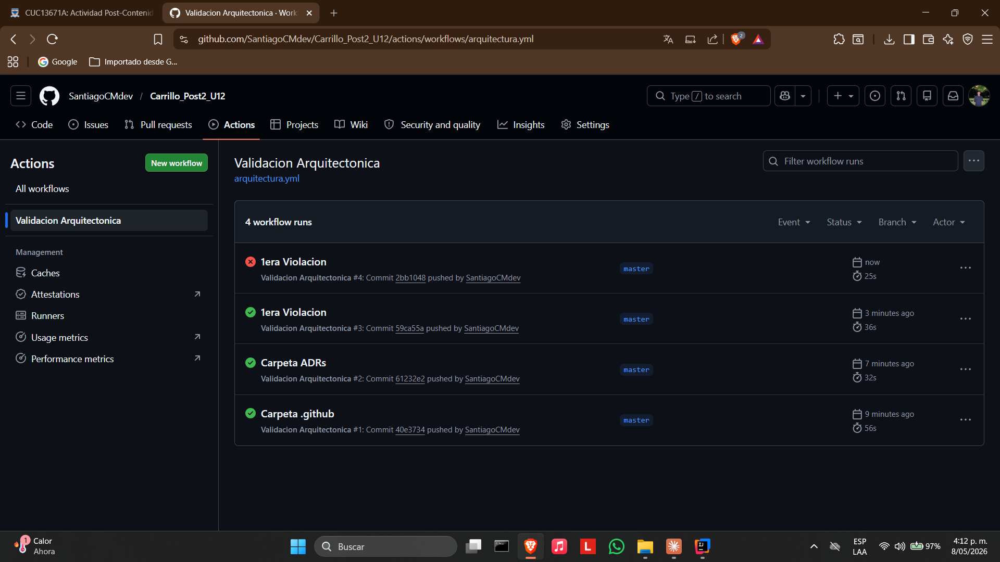
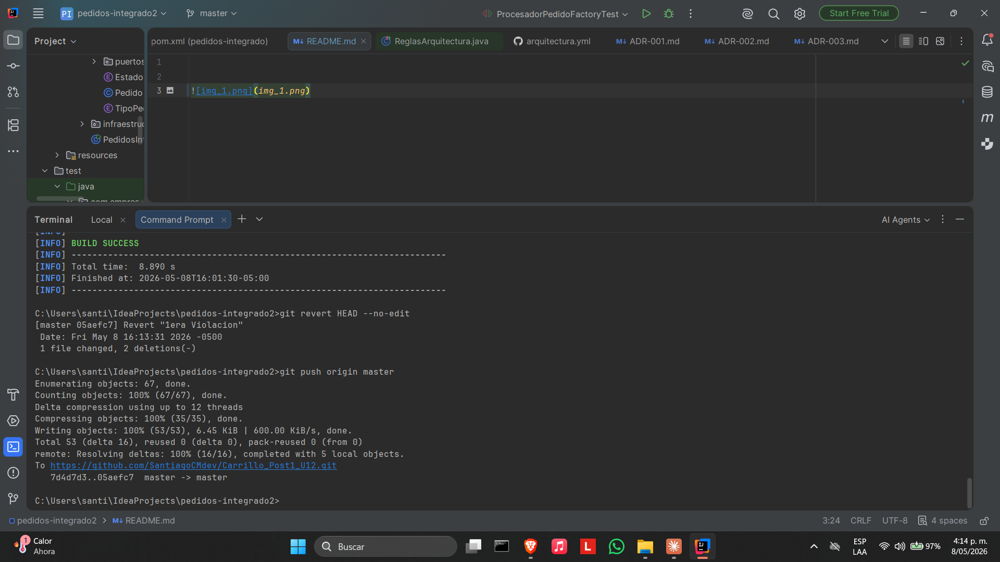
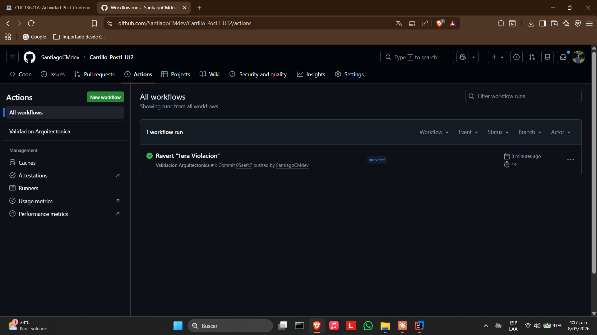

# Pedidos Integrado — Post-Contenido 2 Unidad 12


Sistema de gestión de pedidos en **Spring Boot 3** que extiende el Post-Contenido 1 con validación arquitectónica automatizada usando **ArchUnit**, documentación de decisiones de diseño en formato **ADR**, y verificación del pipeline en **GitHub Actions**.

---

## Tecnologías utilizadas

- Java 21
- Spring Boot 3
- Spring Data JPA
- H2 Database (en memoria)
- Lombok
- Maven
- JaCoCo 0.8.11
- ArchUnit 1.2.1
- GitHub Actions

---

## Estructura del proyecto

```
pedidos-integrado2/
├── .github/
│   └── workflows/
│       └── arquitectura.yml          # Pipeline de validación arquitectónica
├── docs/
│   └── adr/
│       ├── ADR-001.md                # Arquitectura Hexagonal
│       ├── ADR-002.md                # Factory + Strategy
│       └── ADR-003.md                # Spring Events (Observer)
├── src/
│   ├── main/java/com/empresa/pedidos/
│   │   ├── dominio/
│   │   │   ├── puertos/              # Interfaces (puertos hexagonales)
│   │   ├── aplicacion/
│   │   ├── infraestructura/
│   │   └── adaptadores/
│   │       ├── procesadores/         # Strategy + Factory
│   │       ├── facade/               # Facade
│   │       └── rest/                 # Controlador REST
│   └── test/java/com/empresa/pedidos/
│       ├── ProcesadorPedidoFactoryTest.java
│       ├── ReglasArquitectura.java   # Reglas ArchUnit
│       └── PedidosIntegradoApplicationTests.java
├── pom.xml
└── README.md
```

---

## Cómo ejecutar el proyecto

### 1. Compilar y ejecutar todas las pruebas

```bash
mvn clean verify
```

### 2. Ejecutar solo las reglas de arquitectura

```bash
mvn test -Dtest=ReglasArquitectura
```

---

## Validación Arquitectónica con ArchUnit

Se implementaron 5 reglas ArchUnit en `ReglasArquitectura.java` que se ejecutan automáticamente en cada push como pruebas unitarias verificables:

### Regla 1 — Dominio aislado
El paquete `dominio` no puede depender de `infraestructura` ni de `adaptadores`. Garantiza que el dominio sea puro y testeable sin contenedor Spring.

```java
static final ArchRule dominioAislado = noClasses()
    .that().resideInAPackage("..dominio..")
    .should().dependOnClassesThat()
    .resideInAnyPackage("..infraestructura..", "..adaptadores..");
```

### Regla 2 — Controlador solo depende de la Facade
Las clases en `adaptadores.rest` solo pueden tener dependencias hacia `adaptadores.facade`, `dominio` y paquetes de Spring Web. Evita que el controlador conozca la lógica interna del sistema.

```java
static final ArchRule controladorSoloFacade = classes()
    .that().resideInAPackage("..adaptadores.rest..")
    .should().onlyHaveDependentClassesThat()
    .resideInAnyPackage("..adaptadores.rest..", "..adaptadores.facade..",
            "..dominio..", "org.springframework.web..", "java..");
```

### Regla 3 — Puertos de dominio son interfaces
Todas las clases en `dominio.puertos` deben ser interfaces. Garantiza que los puertos hexagonales sean contratos puros sin implementación.

```java
static final ArchRule puertosComoInterfaces = classes()
    .that().resideInAPackage("..dominio.puertos..")
    .should().beInterfaces();
```

### Regla 4 — Procesadores implementan el puerto Strategy
Las clases en `adaptadores.procesadores` que implementan `ProcesadorPedido` deben hacerlo correctamente. Verifica que el patrón Strategy esté correctamente aplicado.

```java
static final ArchRule procesadoresImplementanPuerto = classes()
    .that().resideInAPackage("..adaptadores.procesadores..")
    .and().implement(ProcesadorPedido.class)
    .should().implement(ProcesadorPedido.class);
```

### Regla 5 — Infraestructura no accede a adaptadores REST
Las clases en `infraestructura` no pueden acceder a clases en `adaptadores.rest`. Evita dependencias circulares entre capas.

```java
static final ArchRule infraNoAccedeRest = noClasses()
    .that().resideInAPackage("..infraestructura..")
    .should().accessClassesThat()
    .resideInAPackage("..adaptadores.rest..");
```

**Resultado:** `Tests run: 5, Failures: 0, Errors: 0, Skipped: 0` ✅

---

## Pipeline de GitHub Actions

El workflow `arquitectura.yml` se ejecuta automáticamente en cada push a `master`:

1. Configura Java 21 (Temurin) con caché de Maven
2. Ejecuta `mvn test -Dtest=ReglasArquitectura` — valida las 5 reglas arquitectónicas
3. Ejecuta `mvn verify` — suite completa de pruebas

### Evidencia de violación intencional

Se introdujo una violación intencional agregando una dependencia de `Pedido.java` (dominio) hacia `RepositorioPedidosJpa` (infraestructura), lo que viola la Regla 1. El pipeline detectó la violación y falló con el mensaje de ArchUnit. Posteriormente se revirtió el commit y el pipeline volvió a verde, demostrando que el sistema de validación funciona correctamente.

| Commit | Estado | Descripción |
|---|---|---|
| feat: reglas ArchUnit y ADRs | ✅ Verde | Implementación inicial |
| test: violacion intencional | ❌ Rojo | ArchUnit detectó violación de dominio |
| Revert violacion intencional | ✅ Verde | Pipeline restaurado |

---

## Decisiones de Diseño (ADRs)

Las decisiones arquitectónicas más importantes del sistema están documentadas en `docs/adr/`:

| ADR | Título | Estado |
|---|---|---|
| [ADR-001](docs/adr/ADR-001.md) | Arquitectura Hexagonal para aislar el dominio | Aceptado |
| [ADR-002](docs/adr/ADR-002.md) | Factory + Strategy para selección de procesador | Aceptado |
| [ADR-003](docs/adr/ADR-003.md) | Spring Events (Observer) para notificaciones | Aceptado |

### Resumen de ADR-001 — Arquitectura Hexagonal
El dominio define puertos (interfaces). Los adaptadores e infraestructura implementan esos puertos. El dominio no importa ninguna clase de Spring ni de JPA, lo que lo hace testeable con Mockito sin contenedor.

### Resumen de ADR-002 — Factory + Strategy
La combinación de Strategy (una implementación por tipo de pedido) con Factory (selección dinámica por mapa) elimina el `if/else if` del servicio principal, reduce la CC de 4 a 1 y permite agregar nuevos tipos sin modificar código existente.

### Resumen de ADR-003 — Spring Events (Observer)
`ApplicationEventPublisher` publica `PedidoProcesadoEvent` tras procesar un pedido. Cada canal de notificación implementa un `@EventListener` independiente. La `FachadaPedidos` no conoce quién escucha el evento.

---

## Endpoints disponibles

| Método | URL | Descripción |
|---|---|---|
| POST | `/api/pedidos` | Crea y procesa un pedido |
| GET | `/api/pedidos/{id}` | Busca un pedido por ID |

---

## Santiago Carrillo

Laboratorio Post-Contenido 2 — Unidad 12: Integración de Patrones y Arquitecturas
Ingeniería de Sistemas — Universidad de Santander (UDES) — 2026

1era Violación a propósito


Reversion


Efecto:
